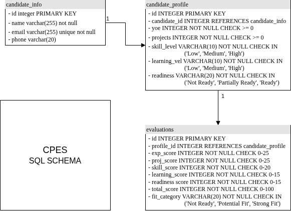

# Candidate Profile Evaluation System (CPES)

## System Architecture

The system follows a layered architecture as illustrated below:


1.  **API Layer (FastAPI)**: This is the entry point defined in `main.py`. It handles HTTP requests, validates input using Pydantic schemas (`schemas.py`), and manages the database session.
2.  **Logic Layer (Service)**: Contains the deterministic scoring rules in `logic.py`. This ensures the business logic is decoupled from the API and data access layers, making it easier to test and maintain.
3.  **Storage Layer (SQLAlchemy)**: Manages data persistence using SQLite. The data models are defined in `models.py` and the connection setup in `database.py`.

## SQL Schema

The database schema is designed to normalize candidate information and their evaluation history:



- **candidates**: Stores unique candidate identity (name, email, phone). The email is used as a unique constraint to prevent duplicates.
- **profiles**: Linked to a candidate, this table stores the raw input data for a specific evaluation snapshot (experience, projects, skills, etc.). This allows a candidate to have multiple profiles over time.
- **evaluations**: Linked to a profile, this table stores the computed results including individual component scores, total score, fit category, and a summary explanation.

## Data Flow Diagram

The following diagram illustrates the flow of data from the initial request to the final stored evaluation:


## NoSQL Schema

For the NoSQL document structure and sample JSON, refer to [nosql_schema.md](nosql_schema.md).

## Setup and Usage

1.  **Install Dependencies**:
    ```bash
    pip install -r requirements.txt
    ```

2.  **Run the Server**:
    ```bash
    uvicorn main:app --reload
    ```

3.  **API Endpoints**:
    - **POST /evaluate**: Submit a candidate profile for evaluation.
        - Body:
          ```json
          {
            "name": "Jane Doe",
            "email": "jane@example.com",
            "years_of_experience": 5,
            "num_projects": 5,
            "skill_level": "High",
            "learning_velocity": "High",
            "role_readiness": "Ready"
          }
          ```
    - **GET /evaluations/{id}**: Retrieve a past evaluation result.
    - **GET /candidate/{id}**: Retrieve information about a specific candidate.

## Scoring Logic

- **Experience**: `min(5 * years, 25)`
- **Projects**: `min(4 * projects, 25)`
- **Skill Level**: Low=5, Medium=13, High=20
- **Learning Velocity**: Low=3, Medium=10, High=15
- **Role Readiness**: Not Ready=3, Partially Ready=10, Ready=15
- **Total**: Sum of above (Max 100)

## Edge Case Handling

1.  **High Values**: Experience and Project scores are capped at 25. Even if a user enters 100 years of experience, the score remains 25.
2.  **Duplicate Candidates**: The system checks for existing candidates by email. If found, it links the new profile to the existing candidate.
3.  **Input Validation**: Pydantic models ensure that scores are non-negative and Enum values are valid strings.
4.  **Data Integrity**: Foreign keys ensure that evaluations are always linked to valid profiles.
